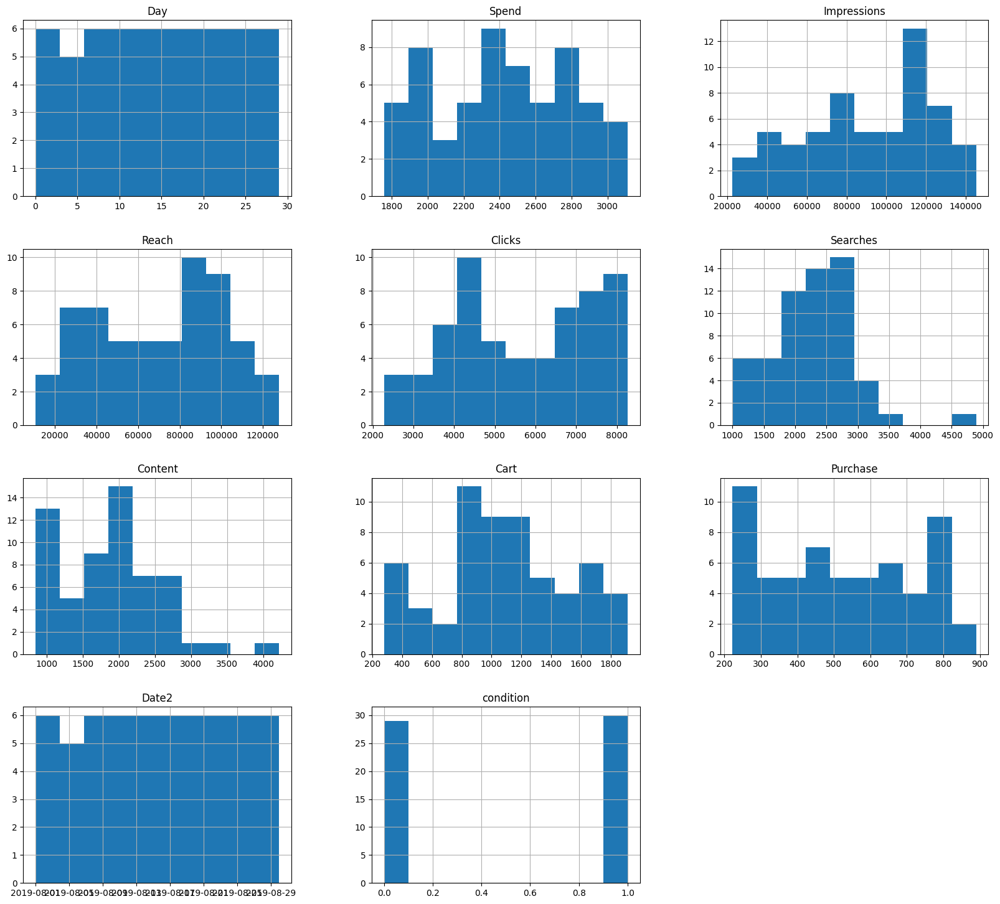
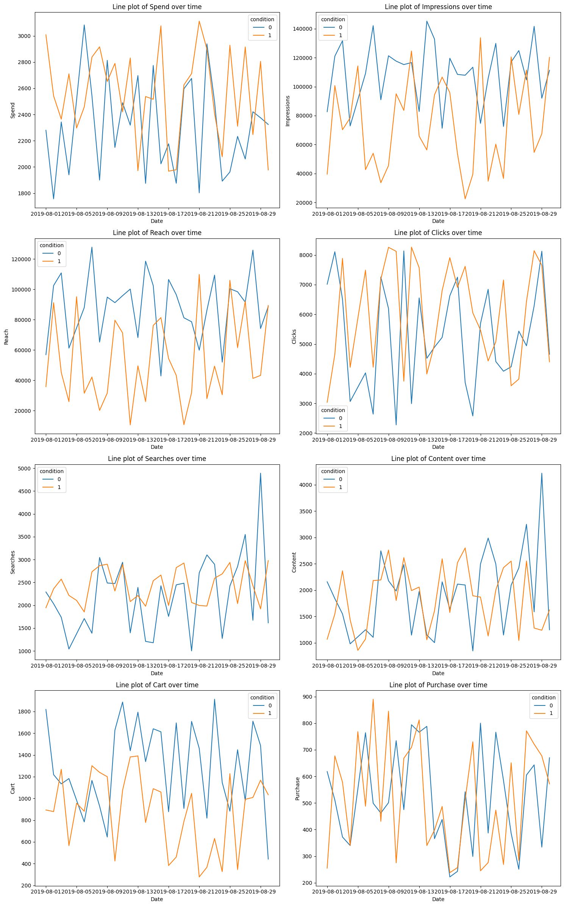
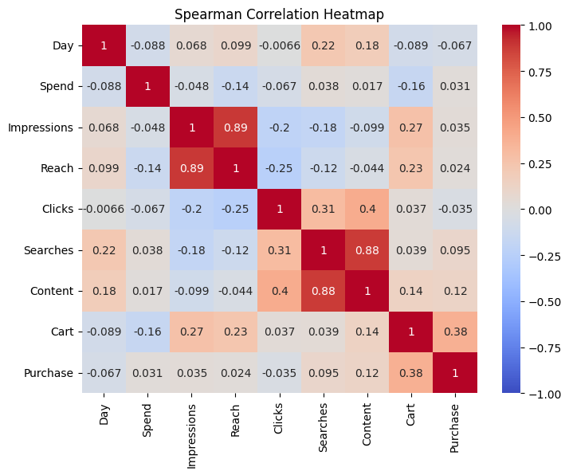
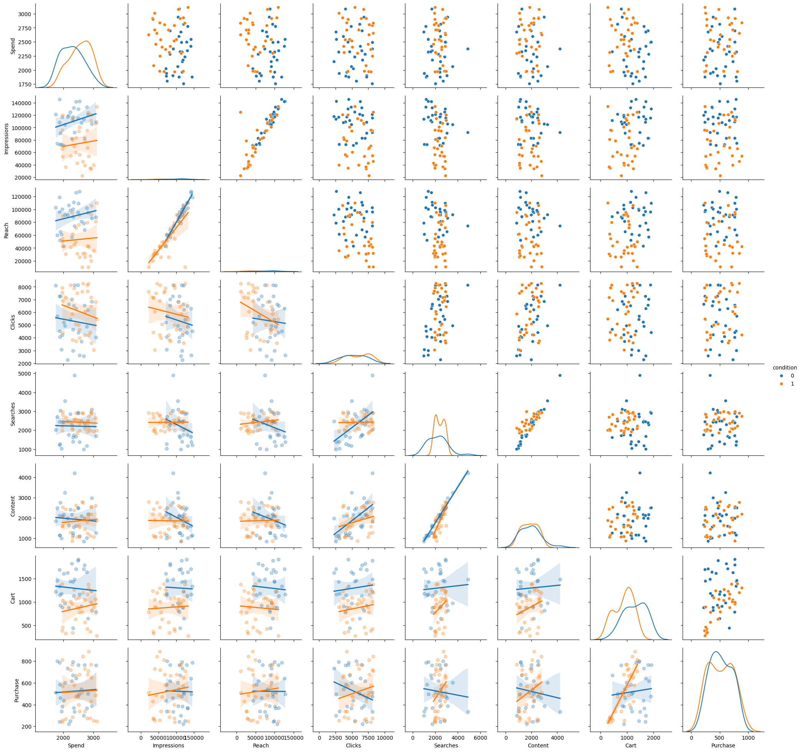

# A-B-Testing of Marketing Campaign

## Summary

Control and treatment marketing campaigns were tested for their impact on website sales over 30 days in August 2019.
* No evidence that treatment campaign outperformed control campaign.
* Treatment group received a greater amount of spend for marketing during the campaign.
* Control group generated more impressions, reach, and items in the cart (though not actual purchases).
* Possibility that under treatment condition, items in the cart were more likely to be translated into purchases. But not statistically significant.

## Introduction

The data is from a dataset on kaggle (https://www.kaggle.com/datasets/amirmotefaker/ab-testing-dataset) that contains data on testing the effects of a marketing campaign on a website sales over 30 days in August 2019.

Variables included in the dataset are as follows:

* Campaign Name: The name of the campaign (Control Campaign, Test Campaign)
* Date: Date of the record
* Spend: Amount spent on the campaign in dollars
* Impressions: Number of impressions the ad crossed through the campaign
* Reach: The number of unique impressions received in the ad
* Clicks: Number of website clicks received through the ads
* Searches: Number of users who performed searches on the website
* Content: Number of users who viewed content and products on the website
* Cart: Number of users who added products to the cart
* Number of purchases


## Data Cleaning & Preparation

### Import libraries and datsets

```python
# Import libraries
import pandas as pd
import numpy as np
import datetime
import seaborn as sns
import matplotlib.pyplot as plt
```

```python
# Upload and join datasets
control_df = pd.read_csv("control_group.csv", delimiter=";")
treatment_df = pd.read_csv("test_group.csv", delimiter=";")

market_df = pd.concat([control_df, treatment_df], axis=0)
market_df = market_df.reset_index()
```

### Checking for Missing Values
#### Case with index 4 has missing values (8/4/19, control condition). Dropped from analysis.

```python
# Check for missing values.
market_df.info()
```

    <class 'pandas.core.frame.DataFrame'>
    RangeIndex: 60 entries, 0 to 59
    Data columns (total 11 columns):
     #   Column               Non-Null Count  Dtype  
    ---  ------               --------------  -----  
     0   index                60 non-null     int64  
     1   Campaign Name        60 non-null     object 
     2   Date                 60 non-null     object 
     3   Spend [USD]          60 non-null     int64  
     4   # of Impressions     59 non-null     float64
     5   Reach                59 non-null     float64
     6   # of Website Clicks  59 non-null     float64
     7   # of Searches        59 non-null     float64
     8   # of View Content    59 non-null     float64
     9   # of Add to Cart     59 non-null     float64
     10  # of Purchase        59 non-null     float64
    dtypes: float64(7), int64(2), object(2)
    memory usage: 5.3+ KB

```python
# Drop missing case.
market_df.drop(index=4, inplace=True)

```
### Rename variables for ease of use.

```python
# Rename variables for ease.
market_df.rename(columns={'index': 'Day', 'Campaign Name': 'Campaign', 'Spend [USD]': 'Spend', '# of Impressions': 'Impressions', '# of Website Clicks': 'Clicks', '# of Searches': 'Searches', '# of View Content': 'Content', '# of Add to Cart': 'Cart', '# of Purchase': 'Purchase'}, inplace=True)
```


### Run descriptive statistics. 

```
market_df.describe()

```

<table border="1" class="dataframe">
  <thead>
    <tr style="text-align: right;">
      <th></th>
      <th>Day</th>
      <th>Spend</th>
      <th>Impressions</th>
      <th>Reach</th>
      <th>Clicks</th>
      <th>Searches</th>
      <th>Content</th>
      <th>Cart</th>
      <th>Purchase</th>
    </tr>
  </thead>
  <tbody>
    <tr>
      <th>count</th>
      <td>59.000000</td>
      <td>59.000000</td>
      <td>59.000000</td>
      <td>59.000000</td>
      <td>59.000000</td>
      <td>59.000000</td>
      <td>59.000000</td>
      <td>59.000000</td>
      <td>59.000000</td>
    </tr>
    <tr>
      <th>mean</th>
      <td>14.677966</td>
      <td>2435.762712</td>
      <td>91775.881356</td>
      <td>70868.644068</td>
      <td>5682.593220</td>
      <td>2321.813559</td>
      <td>1900.169492</td>
      <td>1087.220339</td>
      <td>522.000000</td>
    </tr>
    <tr>
      <th>std</th>
      <td>8.692924</td>
      <td>376.358795</td>
      <td>32465.070636</td>
      <td>31023.653515</td>
      <td>1754.777559</td>
      <td>669.040576</td>
      <td>687.263844</td>
      <td>430.205246</td>
      <td>196.973917</td>
    </tr>
    <tr>
      <th>min</th>
      <td>0.000000</td>
      <td>1757.000000</td>
      <td>22521.000000</td>
      <td>10598.000000</td>
      <td>2277.000000</td>
      <td>1001.000000</td>
      <td>848.000000</td>
      <td>278.000000</td>
      <td>222.000000</td>
    </tr>
    <tr>
      <th>25%</th>
      <td>7.500000</td>
      <td>2113.500000</td>
      <td>68853.500000</td>
      <td>43230.000000</td>
      <td>4227.500000</td>
      <td>1962.500000</td>
      <td>1249.000000</td>
      <td>848.500000</td>
      <td>340.000000</td>
    </tr>
    <tr>
      <th>50%</th>
      <td>15.000000</td>
      <td>2421.000000</td>
      <td>95843.000000</td>
      <td>76219.000000</td>
      <td>5691.000000</td>
      <td>2390.000000</td>
      <td>1975.000000</td>
      <td>1075.000000</td>
      <td>501.000000</td>
    </tr>
    <tr>
      <th>75%</th>
      <td>22.000000</td>
      <td>2743.000000</td>
      <td>117315.000000</td>
      <td>95490.500000</td>
      <td>7218.500000</td>
      <td>2778.500000</td>
      <td>2424.000000</td>
      <td>1386.500000</td>
      <td>693.000000</td>
    </tr>
    <tr>
      <th>max</th>
      <td>29.000000</td>
      <td>3112.000000</td>
      <td>145248.000000</td>
      <td>127852.000000</td>
      <td>8264.000000</td>
      <td>4891.000000</td>
      <td>4219.000000</td>
      <td>1913.000000</td>
      <td>890.000000</td>
    </tr>
  </tbody>
</table>
</div>

### Recode date variable into datetime. Convert Campaign into numeric condition variable.

```python
# Convert date into datetime variable in python for better manipulation.

import pandas as pd

Date = market_df['Date']

date_obj = pd.to_datetime(Date, dayfirst=True,format="mixed")

market_df['Date2'] = date_obj
```

```python
# Importing LabelEncoder from Sklearn library from preprocessing Module.
# Change string variable of campaign into numeric variable.

from sklearn.preprocessing import LabelEncoder
le = LabelEncoder()
condition = le.fit_transform(market_df['Campaign'])
market_df["condition"] = condition

```
## Exploratory Data Analysis

### Examining distributions of variables.

#### Histograms below show variables generally have uniform or non-normal distribution. Searches and Content appear to each have an outlier. Given the small sample size and non-normal distributions, non-parametric tests will be used for testing differences between marketing campaigns. Non-parametric statistics are less sensitive to outliers.


```python
market_df.hist(figsize=(20, 18))  
plt.show()
```
   

    
### Examining distribution of variables by condition over time.

#### Since the two marketing campaigns were conducted and measured on the same days, I wanted to check on common variance between the two marketing conditions that would call into question using an assumption of independent samples in testing differences. Over-time trends appeared random over time and not correlated between the two campaigns. A non-parametric test assuming independence of samples will be used (Mann Whitley U Test).

```python
import seaborn as sns
import matplotlib.pyplot as plt

# List of the variables you're interested in
variables = ['Spend', 'Impressions', 'Reach', 'Clicks', 'Searches', 'Content', 'Cart', 'Purchase']

# Set up the figure with subplots in a horizontal layout
n_cols = 2  # Number of columns you want
n_rows = len(variables) // n_cols + (len(variables) % n_cols > 0)  # Number of rows, based on the number of variables

# Set up the figure with the right number of rows and columns
fig, axes = plt.subplots(n_rows, n_cols, figsize=(15, 6 * n_rows))

# Flatten axes array to easily index them
axes = axes.flatten()

# Loop through the variables and create a line plot for each
for i, var in enumerate(variables):
    sns.lineplot(data=market_df, x='Date2', y=var, hue='condition', ax=axes[i])
    axes[i].set_title(f'Line plot of {var} over time')
    axes[i].set_xlabel('Date')  # Add x-label for clarity
    axes[i].set_ylabel(var)     # Add y-label for clarity

# Remove unused subplots if any
for j in range(i + 1, len(axes)):
    axes[j].axis('off')  # Hide empty subplots

# Adjust the layout to avoid overlap
plt.tight_layout()
plt.show()
```

   



### Examining impact of marketing campaigns.

#### The impact of the two marketing campaigns is seen by looking at whether the two campaigns make a difference in accessing the website (clicks, content, reach, searches, impressions, intending to purchase (Cart), and actual purchases from the website (Purchase). An additional variable of amound of spend for each marketing campaign is also included for context. 

#### Differences are presented by median levels, statistical differences using the Mann Whitney U Test, and visually through clustered boxplots by marketing campaign.

#### The control group generated more impressions, reach, and items in the cart (though not actual purchases), while the treatment group received a greater amount of spend for marketing during the campaign.


```python
# Look at medians by condition
medians_pivot = market_df.pivot_table(values=['Spend', 'Impressions', 'Reach', 'Clicks', 'Searches', 'Content', 'Cart', 'Purchase'], index='condition', aggfunc='median')
print("\nMedians by Category (using pivot_table()):\n", medians_pivot)
```

    
##### Medians by Category 

|Campaign | Cart | Clicks | Content | Impressions | Purchase | Reach | Searches | Spend |
|:---|---:|---:| ---:|---:|---:|---:|---:|---:|
|Control (0)      | 1339.0  |5224.0  | 1984.0     |113430.0    | 501.0  |1579.0  |  2390.0| 2319.0|
|Treatment (1) | 974.0 | 6242.5 |  1881.0|      68853.5  |   500.0 | 44219.5 |   2395.5| 2584.0|


```python
from scipy.stats import mannwhitneyu
# Group column and outcome columns
group_column = 'condition'
outcome_columns = ['Spend', 'Impressions', 'Reach', 'Clicks', 'Searches', 'Content', 'Cart', 'Purchase']

# Function to perform Mann-Whitney U test on multiple columns
def mann_whitney_multiple(market_df, group_column, outcome_columns):
    results = []
    
    # Loop through each outcome column
    for column in outcome_columns:
        # Split the data into two groups based on the group_column
        group_1 = market_df[market_df[group_column] == market_df[group_column].unique()[0]][column]
        group_2 = market_df[market_df[group_column] == market_df[group_column].unique()[1]][column]
        
        # Perform the Mann-Whitney U test
        stat, p_value = mannwhitneyu(group_1, group_2)
        
        # Append the result
        results.append({
            'Outcome': column,
            'U-Statistic': stat,
            'p-value': p_value
        })
    
    # Convert results to a DataFrame
    results_df = pd.DataFrame(results)
    
    return results_df

# Call the function to get results
results_df = mann_whitney_multiple(market_df, group_column, outcome_columns)

# Print the results
print(results_df)

```
#### Tests of Difference Between Campaigns Using Mann Whitney U Test

|Variable|U-Statistics|p-value|Outcom|
|---:|---:|---:|---:|
|Spend|257.0|.007|Spend higher for treatment|
|Impressions     |   697.0 | 0.007|Impressions higher for control|
|Reach|719.0|>0.000|Reach higher for control|
|Clicks|337.0|0.139|No difference|
|Searches|346.0|0.180|No difference|
|Content|442.0|0.921|No difference|
|Cart|664.0|0.001|Cart higher for control|
|Purchase|439.0|0.958|No difference|


```python
import seaborn as sns
import matplotlib.pyplot as plt

# List of the variables you're interested in
variables = ['Spend', 'Impressions', 'Reach', 'Clicks', 'Searches', 'Content', 'Cart', 'Purchase']

# Set up the figure with subplots in a horizontal layout
n_cols = 4  # Number of columns you want
n_rows = len(variables) // n_cols + (len(variables) % n_cols > 0)  # Number of rows, based on the number of variables

# Set up the figure with the right number of rows and columns
fig, axes = plt.subplots(n_rows, n_cols, figsize=(15, 6 * n_rows))

# Flatten axes array to easily index them
axes = axes.flatten()

# Loop through the variables and create a boxplot for each
for i, var in enumerate(variables):
    sns.boxplot(x="condition", y=var, data=market_df, ax=axes[i])
    axes[i].set_title(f'Boxplot of {var} by Condition')

# Remove unused subplots if any
for j in range(i + 1, len(axes)):
    axes[j].axis('off')  # Hide empty subplots

# Adjust the layout to avoid overlap
plt.tight_layout()
plt.show()


```


## Looking for confounding relationships.

### Spearman rank correlations between variables

#### The heatmap below shows the strength of relationships between pairs of variables. The stronger the relationship, the higher the coefficient, and brighter red the indicator. There are particularly strong relationships between Reach, Impressions, Content, and Searches. However, only one of the variables (Cart) is related to the main outcome of Purchases.

```
# Check for correlations among variables using Spearman Rank correlation coefficients.

outcome_df = market_df[['Day', 'Spend', 'Impressions', 'Reach', 'Clicks', 'Searches', 'Content', 'Cart', 'Purchase']]

spearman_corr_matrix = outcome_df.corr(method='spearman')

# Create heatmap to check correlations.
plt.figure(figsize=(8, 6))  
sns.heatmap(spearman_corr_matrix, annot=True, cmap='coolwarm', vmin=-1, vmax=1)
plt.title('Spearman Correlation Heatmap')
plt.show()

```
    


### Scatter graphs showing relationships between variables by each marketing condition

#### A univariate regresssion line is presented for each marketing condition in the graphs in the lower half. When the two lines are roughly parallel, there is no difference by marketing condition betwwen in the relationship between the two variables (e.g. Impressions and Reach) - that they work the same under either marketing campaign.  The different lines for the relationship between Cart and Purchase suggests this relationship may differ between marketing campaigns. This is tested in the detailed multivariate regression model below.
```

python
import seaborn as sns
import matplotlib.pyplot as plt

market2_df = market_df[['Spend', 'Impressions', 'Reach', 'Clicks', 'Searches', 'Content', 'Cart', 'Purchase', 'condition']]

# Create a PairGrid
g = sns.PairGrid(market2_df, hue='condition')

# Map regplot to the lower triangle
g.map_lower(sns.regplot, scatter_kws={'alpha': 0.3})

# Map kdeplot to the diagonal
g.map_diag(sns.kdeplot)

# Map scatterplot to the upper triangle
g.map_upper(sns.scatterplot)

# Add a legend
g.add_legend()

# Show the plot
plt.show()
```
    

    

### Examining the relationship between campaign, number of items in cart, and purchases.

#### Controlling for number of items in cart, campaign condition does not make a statistically significant contribution to purchases.

```python
import statsmodels.api as sm

y = market_df['Purchase']
X = market_df[['condition', 'Cart']] 
X = sm.add_constant(X)
model = sm.OLS(y, X)
results = model.fit()

print(results.summary())
```

                                OLS Regression Results                            
    ==============================================================================
    Dep. Variable:               Purchase   R-squared:                       0.194
    Model:                            OLS   Adj. R-squared:                  0.165
    Method:                 Least Squares   F-statistic:                     6.736
    Date:                Mon, 17 Mar 2025   Prob (F-statistic):            0.00239
    Time:                        10:24:13   Log-Likelihood:                -388.55
    No. Observations:                  59   AIC:                             783.1
    Df Residuals:                      56   BIC:                             789.3
    Df Model:                           2                                         
    Covariance Type:            nonrobust                                         
    ==============================================================================
                     coef    std err          t      P>|t|      [0.025      0.975]
    ------------------------------------------------------------------------------
    const        222.0302     88.498      2.509      0.015      44.747     399.313
    condition     95.2550     53.782      1.771      0.082     -12.483     202.993
    Cart           0.2314      0.063      3.670      0.001       0.105       0.358
    ==============================================================================
    Omnibus:                        3.279   Durbin-Watson:                   2.490
    Prob(Omnibus):                  0.194   Jarque-Bera (JB):                1.709
    Skew:                           0.031   Prob(JB):                        0.426
    Kurtosis:                       2.169   Cond. No.                     4.85e+03
    ==============================================================================
    
    Notes:
    [1] Standard Errors assume that the covariance matrix of the errors is correctly specified.
    [2] The condition number is large, 4.85e+03. This might indicate that there are
    strong multicollinearity or other numerical problems.

