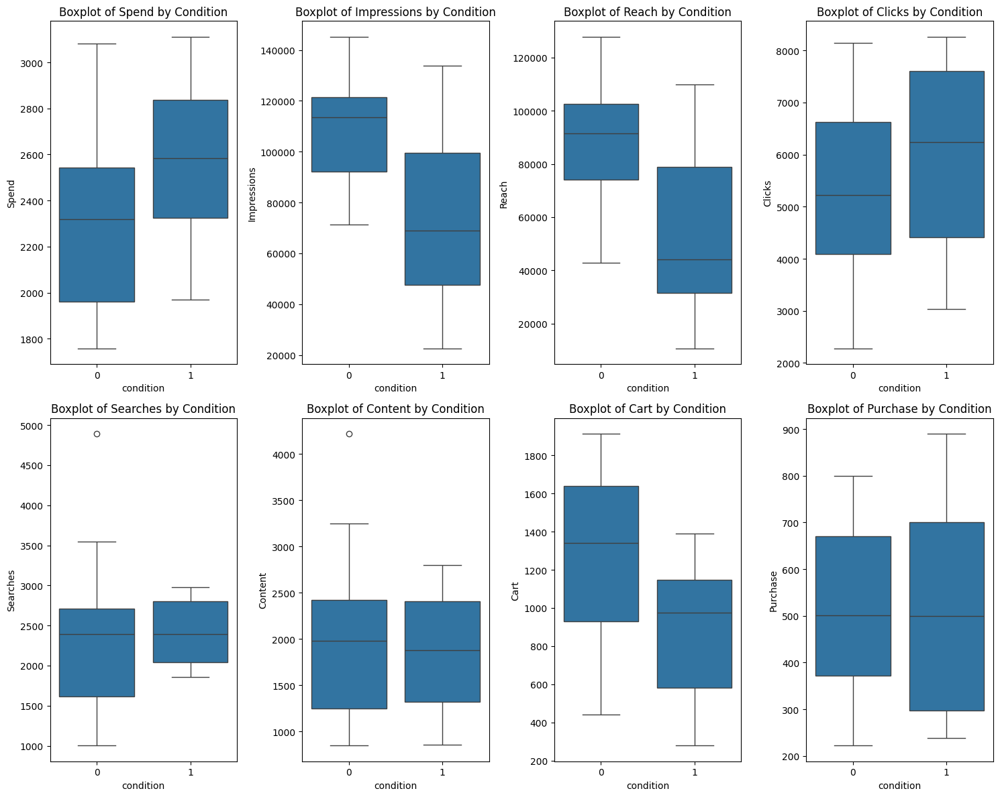

# A-B-Testing

## Summary

Control and treatment marketing campaigns were tested for their impact on website sales over 30 days in August 2019.
* No evidence that treatment campaign outperformed control campaign.
* Treatment group received a greater amount of spend for marketing during the campaign.
* Control group generated more impressions, reach, and items in the cart (though not actual purchases).
* Possibility that under treatment condition, items in the cart were more likely to be translated into purchases. But not statistically significant.

## Introduction

The data is from a dataset on kaggle (https://www.kaggle.com/datasets/amirmotefaker/ab-testing-dataset) that contains data on testing the effects of a marketing campaign on a website sales over 30 days in August 2019.

Variables included in the dataset are as follows:

* Campaign Name: The name of the campaign (Control Campaign, Test Campaign)
* Date: Date of the record
* Spend: Amount spent on the campaign in dollars
* Impressions: Number of impressions the ad crossed through the campaign
* Reach: The number of unique impressions received in the ad
* Clicks: Number of website clicks received through the ads
* Searches: Number of users who performed searches on the website
* Content: Number of users who viewed content and products on the website
* Cart: Number of users who added products to the cart
* Number of purchases


## Data Cleaning & Preparation


## Exploratory Data Analysis 


## Tests of Significance Between Conditions


```python
# Import libraries
import pandas as pd
import numpy as np
import datetime
import seaborn as sns
import matplotlib.pyplot as plt
```


```python
# Upload and join datasets
control_df = pd.read_csv("control_group.csv", delimiter=";")
treatment_df = pd.read_csv("test_group.csv", delimiter=";")

market_df = pd.concat([control_df, treatment_df], axis=0)
market_df = market_df.reset_index()

```


```python
market_df
```


<div>
<style scoped>
    .dataframe tbody tr th:only-of-type {
        vertical-align: middle;
    }

    .dataframe tbody tr th {
        vertical-align: top;
    }

    .dataframe thead th {
        text-align: right;
    }
</style>
<table border="1" class="dataframe">
  <thead>
    <tr style="text-align: right;">
      <th></th>
      <th>index</th>
      <th>Campaign Name</th>
      <th>Date</th>
      <th>Spend [USD]</th>
      <th># of Impressions</th>
      <th>Reach</th>
      <th># of Website Clicks</th>
      <th># of Searches</th>
      <th># of View Content</th>
      <th># of Add to Cart</th>
      <th># of Purchase</th>
    </tr>
  </thead>
  <tbody>
    <tr>
      <th>0</th>
      <td>0</td>
      <td>Control Campaign</td>
      <td>1.08.2019</td>
      <td>2280</td>
      <td>82702.0</td>
      <td>56930.0</td>
      <td>7016.0</td>
      <td>2290.0</td>
      <td>2159.0</td>
      <td>1819.0</td>
      <td>618.0</td>
    </tr>
    <tr>
      <th>1</th>
      <td>1</td>
      <td>Control Campaign</td>
      <td>2.08.2019</td>
      <td>1757</td>
      <td>121040.0</td>
      <td>102513.0</td>
      <td>8110.0</td>
      <td>2033.0</td>
      <td>1841.0</td>
      <td>1219.0</td>
      <td>511.0</td>
    </tr>
    <tr>
      <th>2</th>
      <td>2</td>
      <td>Control Campaign</td>
      <td>3.08.2019</td>
      <td>2343</td>
      <td>131711.0</td>
      <td>110862.0</td>
      <td>6508.0</td>
      <td>1737.0</td>
      <td>1549.0</td>
      <td>1134.0</td>
      <td>372.0</td>
    </tr>
    <tr>
      <th>3</th>
      <td>3</td>
      <td>Control Campaign</td>
      <td>4.08.2019</td>
      <td>1940</td>
      <td>72878.0</td>
      <td>61235.0</td>
      <td>3065.0</td>
      <td>1042.0</td>
      <td>982.0</td>
      <td>1183.0</td>
      <td>340.0</td>
    </tr>
    <tr>
      <th>4</th>
      <td>4</td>
      <td>Control Campaign</td>
      <td>5.08.2019</td>
      <td>1835</td>
      <td>NaN</td>
      <td>NaN</td>
      <td>NaN</td>
      <td>NaN</td>
      <td>NaN</td>
      <td>NaN</td>
      <td>NaN</td>
    </tr>
    <tr>
      <th>5</th>
      <td>5</td>
      <td>Control Campaign</td>
      <td>6.08.2019</td>
      <td>3083</td>
      <td>109076.0</td>
      <td>87998.0</td>
      <td>4028.0</td>
      <td>1709.0</td>
      <td>1249.0</td>
      <td>784.0</td>
      <td>764.0</td>
    </tr>
    <tr>
      <th>6</th>
      <td>6</td>
      <td>Control Campaign</td>
      <td>7.08.2019</td>
      <td>2544</td>
      <td>142123.0</td>
      <td>127852.0</td>
      <td>2640.0</td>
      <td>1388.0</td>
      <td>1106.0</td>
      <td>1166.0</td>
      <td>499.0</td>
    </tr>
    <tr>
      <th>7</th>
      <td>7</td>
      <td>Control Campaign</td>
      <td>8.08.2019</td>
      <td>1900</td>
      <td>90939.0</td>
      <td>65217.0</td>
      <td>7260.0</td>
      <td>3047.0</td>
      <td>2746.0</td>
      <td>930.0</td>
      <td>462.0</td>
    </tr>
    <tr>
      <th>8</th>
      <td>8</td>
      <td>Control Campaign</td>
      <td>9.08.2019</td>
      <td>2813</td>
      <td>121332.0</td>
      <td>94896.0</td>
      <td>6198.0</td>
      <td>2487.0</td>
      <td>2179.0</td>
      <td>645.0</td>
      <td>501.0</td>
    </tr>
    <tr>
      <th>9</th>
      <td>9</td>
      <td>Control Campaign</td>
      <td>10.08.2019</td>
      <td>2149</td>
      <td>117624.0</td>
      <td>91257.0</td>
      <td>2277.0</td>
      <td>2475.0</td>
      <td>1984.0</td>
      <td>1629.0</td>
      <td>734.0</td>
    </tr>
    <tr>
      <th>10</th>
      <td>10</td>
      <td>Control Campaign</td>
      <td>11.08.2019</td>
      <td>2490</td>
      <td>115247.0</td>
      <td>95843.0</td>
      <td>8137.0</td>
      <td>2941.0</td>
      <td>2486.0</td>
      <td>1887.0</td>
      <td>475.0</td>
    </tr>
    <tr>
      <th>11</th>
      <td>11</td>
      <td>Control Campaign</td>
      <td>12.08.2019</td>
      <td>2319</td>
      <td>116639.0</td>
      <td>100189.0</td>
      <td>2993.0</td>
      <td>1397.0</td>
      <td>1147.0</td>
      <td>1439.0</td>
      <td>794.0</td>
    </tr>
    <tr>
      <th>12</th>
      <td>12</td>
      <td>Control Campaign</td>
      <td>13.08.2019</td>
      <td>2697</td>
      <td>82847.0</td>
      <td>68214.0</td>
      <td>6554.0</td>
      <td>2390.0</td>
      <td>1975.0</td>
      <td>1794.0</td>
      <td>766.0</td>
    </tr>
    <tr>
      <th>13</th>
      <td>13</td>
      <td>Control Campaign</td>
      <td>14.08.2019</td>
      <td>1875</td>
      <td>145248.0</td>
      <td>118632.0</td>
      <td>4521.0</td>
      <td>1209.0</td>
      <td>1149.0</td>
      <td>1339.0</td>
      <td>788.0</td>
    </tr>
    <tr>
      <th>14</th>
      <td>14</td>
      <td>Control Campaign</td>
      <td>15.08.2019</td>
      <td>2774</td>
      <td>132845.0</td>
      <td>102479.0</td>
      <td>4896.0</td>
      <td>1179.0</td>
      <td>1005.0</td>
      <td>1641.0</td>
      <td>366.0</td>
    </tr>
    <tr>
      <th>15</th>
      <td>15</td>
      <td>Control Campaign</td>
      <td>16.08.2019</td>
      <td>2024</td>
      <td>71274.0</td>
      <td>42859.0</td>
      <td>5224.0</td>
      <td>2427.0</td>
      <td>2158.0</td>
      <td>1613.0</td>
      <td>438.0</td>
    </tr>
    <tr>
      <th>16</th>
      <td>16</td>
      <td>Control Campaign</td>
      <td>17.08.2019</td>
      <td>2177</td>
      <td>119612.0</td>
      <td>106518.0</td>
      <td>6628.0</td>
      <td>1756.0</td>
      <td>1642.0</td>
      <td>878.0</td>
      <td>222.0</td>
    </tr>
    <tr>
      <th>17</th>
      <td>17</td>
      <td>Control Campaign</td>
      <td>18.08.2019</td>
      <td>1876</td>
      <td>108452.0</td>
      <td>96518.0</td>
      <td>7253.0</td>
      <td>2447.0</td>
      <td>2115.0</td>
      <td>1695.0</td>
      <td>243.0</td>
    </tr>
    <tr>
      <th>18</th>
      <td>18</td>
      <td>Control Campaign</td>
      <td>19.08.2019</td>
      <td>2596</td>
      <td>107890.0</td>
      <td>81268.0</td>
      <td>3706.0</td>
      <td>2483.0</td>
      <td>2098.0</td>
      <td>908.0</td>
      <td>542.0</td>
    </tr>
    <tr>
      <th>19</th>
      <td>19</td>
      <td>Control Campaign</td>
      <td>20.08.2019</td>
      <td>2675</td>
      <td>113430.0</td>
      <td>78625.0</td>
      <td>2578.0</td>
      <td>1001.0</td>
      <td>848.0</td>
      <td>1709.0</td>
      <td>299.0</td>
    </tr>
    <tr>
      <th>20</th>
      <td>20</td>
      <td>Control Campaign</td>
      <td>21.08.2019</td>
      <td>1803</td>
      <td>74654.0</td>
      <td>59873.0</td>
      <td>5691.0</td>
      <td>2711.0</td>
      <td>2496.0</td>
      <td>1460.0</td>
      <td>800.0</td>
    </tr>
    <tr>
      <th>21</th>
      <td>21</td>
      <td>Control Campaign</td>
      <td>22.08.2019</td>
      <td>2939</td>
      <td>105705.0</td>
      <td>86218.0</td>
      <td>6843.0</td>
      <td>3102.0</td>
      <td>2988.0</td>
      <td>819.0</td>
      <td>387.0</td>
    </tr>
    <tr>
      <th>22</th>
      <td>22</td>
      <td>Control Campaign</td>
      <td>23.08.2019</td>
      <td>2496</td>
      <td>129880.0</td>
      <td>109413.0</td>
      <td>4410.0</td>
      <td>2896.0</td>
      <td>2496.0</td>
      <td>1913.0</td>
      <td>766.0</td>
    </tr>
    <tr>
      <th>23</th>
      <td>23</td>
      <td>Control Campaign</td>
      <td>24.08.2019</td>
      <td>1892</td>
      <td>72515.0</td>
      <td>51987.0</td>
      <td>4085.0</td>
      <td>1274.0</td>
      <td>1149.0</td>
      <td>1146.0</td>
      <td>585.0</td>
    </tr>
    <tr>
      <th>24</th>
      <td>24</td>
      <td>Control Campaign</td>
      <td>25.08.2019</td>
      <td>1962</td>
      <td>117006.0</td>
      <td>100398.0</td>
      <td>4234.0</td>
      <td>2423.0</td>
      <td>2096.0</td>
      <td>883.0</td>
      <td>386.0</td>
    </tr>
    <tr>
      <th>25</th>
      <td>25</td>
      <td>Control Campaign</td>
      <td>26.08.2019</td>
      <td>2233</td>
      <td>124897.0</td>
      <td>98432.0</td>
      <td>5435.0</td>
      <td>2847.0</td>
      <td>2421.0</td>
      <td>1448.0</td>
      <td>251.0</td>
    </tr>
    <tr>
      <th>26</th>
      <td>26</td>
      <td>Control Campaign</td>
      <td>27.08.2019</td>
      <td>2061</td>
      <td>104678.0</td>
      <td>91579.0</td>
      <td>4941.0</td>
      <td>3549.0</td>
      <td>3249.0</td>
      <td>980.0</td>
      <td>605.0</td>
    </tr>
    <tr>
      <th>27</th>
      <td>27</td>
      <td>Control Campaign</td>
      <td>28.08.2019</td>
      <td>2421</td>
      <td>141654.0</td>
      <td>125874.0</td>
      <td>6287.0</td>
      <td>1672.0</td>
      <td>1589.0</td>
      <td>1711.0</td>
      <td>643.0</td>
    </tr>
    <tr>
      <th>28</th>
      <td>28</td>
      <td>Control Campaign</td>
      <td>29.08.2019</td>
      <td>2375</td>
      <td>92029.0</td>
      <td>74192.0</td>
      <td>8127.0</td>
      <td>4891.0</td>
      <td>4219.0</td>
      <td>1486.0</td>
      <td>334.0</td>
    </tr>
    <tr>
      <th>29</th>
      <td>29</td>
      <td>Control Campaign</td>
      <td>30.08.2019</td>
      <td>2324</td>
      <td>111306.0</td>
      <td>88632.0</td>
      <td>4658.0</td>
      <td>1615.0</td>
      <td>1249.0</td>
      <td>442.0</td>
      <td>670.0</td>
    </tr>
    <tr>
      <th>30</th>
      <td>0</td>
      <td>Test Campaign</td>
      <td>1.08.2019</td>
      <td>3008</td>
      <td>39550.0</td>
      <td>35820.0</td>
      <td>3038.0</td>
      <td>1946.0</td>
      <td>1069.0</td>
      <td>894.0</td>
      <td>255.0</td>
    </tr>
    <tr>
      <th>31</th>
      <td>1</td>
      <td>Test Campaign</td>
      <td>2.08.2019</td>
      <td>2542</td>
      <td>100719.0</td>
      <td>91236.0</td>
      <td>4657.0</td>
      <td>2359.0</td>
      <td>1548.0</td>
      <td>879.0</td>
      <td>677.0</td>
    </tr>
    <tr>
      <th>32</th>
      <td>2</td>
      <td>Test Campaign</td>
      <td>3.08.2019</td>
      <td>2365</td>
      <td>70263.0</td>
      <td>45198.0</td>
      <td>7885.0</td>
      <td>2572.0</td>
      <td>2367.0</td>
      <td>1268.0</td>
      <td>578.0</td>
    </tr>
    <tr>
      <th>33</th>
      <td>3</td>
      <td>Test Campaign</td>
      <td>4.08.2019</td>
      <td>2710</td>
      <td>78451.0</td>
      <td>25937.0</td>
      <td>4216.0</td>
      <td>2216.0</td>
      <td>1437.0</td>
      <td>566.0</td>
      <td>340.0</td>
    </tr>
    <tr>
      <th>34</th>
      <td>4</td>
      <td>Test Campaign</td>
      <td>5.08.2019</td>
      <td>2297</td>
      <td>114295.0</td>
      <td>95138.0</td>
      <td>5863.0</td>
      <td>2106.0</td>
      <td>858.0</td>
      <td>956.0</td>
      <td>768.0</td>
    </tr>
    <tr>
      <th>35</th>
      <td>5</td>
      <td>Test Campaign</td>
      <td>6.08.2019</td>
      <td>2458</td>
      <td>42684.0</td>
      <td>31489.0</td>
      <td>7488.0</td>
      <td>1854.0</td>
      <td>1073.0</td>
      <td>882.0</td>
      <td>488.0</td>
    </tr>
    <tr>
      <th>36</th>
      <td>6</td>
      <td>Test Campaign</td>
      <td>7.08.2019</td>
      <td>2838</td>
      <td>53986.0</td>
      <td>42148.0</td>
      <td>4221.0</td>
      <td>2733.0</td>
      <td>2182.0</td>
      <td>1301.0</td>
      <td>890.0</td>
    </tr>
    <tr>
      <th>37</th>
      <td>7</td>
      <td>Test Campaign</td>
      <td>8.08.2019</td>
      <td>2916</td>
      <td>33669.0</td>
      <td>20149.0</td>
      <td>7184.0</td>
      <td>2867.0</td>
      <td>2194.0</td>
      <td>1240.0</td>
      <td>431.0</td>
    </tr>
    <tr>
      <th>38</th>
      <td>8</td>
      <td>Test Campaign</td>
      <td>9.08.2019</td>
      <td>2652</td>
      <td>45511.0</td>
      <td>31598.0</td>
      <td>8259.0</td>
      <td>2899.0</td>
      <td>2761.0</td>
      <td>1200.0</td>
      <td>845.0</td>
    </tr>
    <tr>
      <th>39</th>
      <td>9</td>
      <td>Test Campaign</td>
      <td>10.08.2019</td>
      <td>2790</td>
      <td>95054.0</td>
      <td>79632.0</td>
      <td>8125.0</td>
      <td>2312.0</td>
      <td>1804.0</td>
      <td>424.0</td>
      <td>275.0</td>
    </tr>
    <tr>
      <th>40</th>
      <td>10</td>
      <td>Test Campaign</td>
      <td>11.08.2019</td>
      <td>2420</td>
      <td>83633.0</td>
      <td>71286.0</td>
      <td>3750.0</td>
      <td>2893.0</td>
      <td>2617.0</td>
      <td>1075.0</td>
      <td>668.0</td>
    </tr>
    <tr>
      <th>41</th>
      <td>11</td>
      <td>Test Campaign</td>
      <td>12.08.2019</td>
      <td>2831</td>
      <td>124591.0</td>
      <td>10598.0</td>
      <td>8264.0</td>
      <td>2081.0</td>
      <td>1992.0</td>
      <td>1382.0</td>
      <td>709.0</td>
    </tr>
    <tr>
      <th>42</th>
      <td>12</td>
      <td>Test Campaign</td>
      <td>13.08.2019</td>
      <td>1972</td>
      <td>65827.0</td>
      <td>49531.0</td>
      <td>7568.0</td>
      <td>2213.0</td>
      <td>2058.0</td>
      <td>1391.0</td>
      <td>812.0</td>
    </tr>
    <tr>
      <th>43</th>
      <td>13</td>
      <td>Test Campaign</td>
      <td>14.08.2019</td>
      <td>2537</td>
      <td>56304.0</td>
      <td>25982.0</td>
      <td>3993.0</td>
      <td>1979.0</td>
      <td>1059.0</td>
      <td>779.0</td>
      <td>340.0</td>
    </tr>
    <tr>
      <th>44</th>
      <td>14</td>
      <td>Test Campaign</td>
      <td>15.08.2019</td>
      <td>2516</td>
      <td>94338.0</td>
      <td>76219.0</td>
      <td>4993.0</td>
      <td>2537.0</td>
      <td>1609.0</td>
      <td>1090.0</td>
      <td>398.0</td>
    </tr>
    <tr>
      <th>45</th>
      <td>15</td>
      <td>Test Campaign</td>
      <td>16.08.2019</td>
      <td>3076</td>
      <td>106584.0</td>
      <td>81389.0</td>
      <td>6800.0</td>
      <td>2661.0</td>
      <td>2594.0</td>
      <td>1059.0</td>
      <td>487.0</td>
    </tr>
    <tr>
      <th>46</th>
      <td>16</td>
      <td>Test Campaign</td>
      <td>17.08.2019</td>
      <td>1968</td>
      <td>95843.0</td>
      <td>54389.0</td>
      <td>7910.0</td>
      <td>1995.0</td>
      <td>1576.0</td>
      <td>383.0</td>
      <td>238.0</td>
    </tr>
    <tr>
      <th>47</th>
      <td>17</td>
      <td>Test Campaign</td>
      <td>18.08.2019</td>
      <td>1979</td>
      <td>53632.0</td>
      <td>43241.0</td>
      <td>6909.0</td>
      <td>2824.0</td>
      <td>2522.0</td>
      <td>461.0</td>
      <td>257.0</td>
    </tr>
    <tr>
      <th>48</th>
      <td>18</td>
      <td>Test Campaign</td>
      <td>19.08.2019</td>
      <td>2626</td>
      <td>22521.0</td>
      <td>10698.0</td>
      <td>7617.0</td>
      <td>2924.0</td>
      <td>2801.0</td>
      <td>788.0</td>
      <td>512.0</td>
    </tr>
    <tr>
      <th>49</th>
      <td>19</td>
      <td>Test Campaign</td>
      <td>20.08.2019</td>
      <td>2712</td>
      <td>39470.0</td>
      <td>31893.0</td>
      <td>6050.0</td>
      <td>2061.0</td>
      <td>1894.0</td>
      <td>1047.0</td>
      <td>730.0</td>
    </tr>
    <tr>
      <th>50</th>
      <td>20</td>
      <td>Test Campaign</td>
      <td>21.08.2019</td>
      <td>3112</td>
      <td>133771.0</td>
      <td>109834.0</td>
      <td>5471.0</td>
      <td>1995.0</td>
      <td>1868.0</td>
      <td>278.0</td>
      <td>245.0</td>
    </tr>
    <tr>
      <th>51</th>
      <td>21</td>
      <td>Test Campaign</td>
      <td>22.08.2019</td>
      <td>2899</td>
      <td>34752.0</td>
      <td>27932.0</td>
      <td>4431.0</td>
      <td>1983.0</td>
      <td>1131.0</td>
      <td>367.0</td>
      <td>276.0</td>
    </tr>
    <tr>
      <th>52</th>
      <td>22</td>
      <td>Test Campaign</td>
      <td>23.08.2019</td>
      <td>2407</td>
      <td>60286.0</td>
      <td>49329.0</td>
      <td>5077.0</td>
      <td>2592.0</td>
      <td>2004.0</td>
      <td>632.0</td>
      <td>473.0</td>
    </tr>
    <tr>
      <th>53</th>
      <td>23</td>
      <td>Test Campaign</td>
      <td>24.08.2019</td>
      <td>2078</td>
      <td>36650.0</td>
      <td>30489.0</td>
      <td>7156.0</td>
      <td>2687.0</td>
      <td>2427.0</td>
      <td>327.0</td>
      <td>269.0</td>
    </tr>
    <tr>
      <th>54</th>
      <td>24</td>
      <td>Test Campaign</td>
      <td>25.08.2019</td>
      <td>2928</td>
      <td>120576.0</td>
      <td>105978.0</td>
      <td>3596.0</td>
      <td>2937.0</td>
      <td>2551.0</td>
      <td>1228.0</td>
      <td>651.0</td>
    </tr>
    <tr>
      <th>55</th>
      <td>25</td>
      <td>Test Campaign</td>
      <td>26.08.2019</td>
      <td>2311</td>
      <td>80841.0</td>
      <td>61589.0</td>
      <td>3820.0</td>
      <td>2037.0</td>
      <td>1046.0</td>
      <td>346.0</td>
      <td>284.0</td>
    </tr>
    <tr>
      <th>56</th>
      <td>26</td>
      <td>Test Campaign</td>
      <td>27.08.2019</td>
      <td>2915</td>
      <td>111469.0</td>
      <td>92159.0</td>
      <td>6435.0</td>
      <td>2976.0</td>
      <td>2552.0</td>
      <td>992.0</td>
      <td>771.0</td>
    </tr>
    <tr>
      <th>57</th>
      <td>27</td>
      <td>Test Campaign</td>
      <td>28.08.2019</td>
      <td>2247</td>
      <td>54627.0</td>
      <td>41267.0</td>
      <td>8144.0</td>
      <td>2432.0</td>
      <td>1281.0</td>
      <td>1009.0</td>
      <td>721.0</td>
    </tr>
    <tr>
      <th>58</th>
      <td>28</td>
      <td>Test Campaign</td>
      <td>29.08.2019</td>
      <td>2805</td>
      <td>67444.0</td>
      <td>43219.0</td>
      <td>7651.0</td>
      <td>1920.0</td>
      <td>1240.0</td>
      <td>1168.0</td>
      <td>677.0</td>
    </tr>
    <tr>
      <th>59</th>
      <td>29</td>
      <td>Test Campaign</td>
      <td>30.08.2019</td>
      <td>1977</td>
      <td>120203.0</td>
      <td>89380.0</td>
      <td>4399.0</td>
      <td>2978.0</td>
      <td>1625.0</td>
      <td>1034.0</td>
      <td>572.0</td>
    </tr>
  </tbody>
</table>
</div>


```python
# Check for missing values.
market_df.info()
```

    <class 'pandas.core.frame.DataFrame'>
    RangeIndex: 60 entries, 0 to 59
    Data columns (total 11 columns):
     #   Column               Non-Null Count  Dtype  
    ---  ------               --------------  -----  
     0   index                60 non-null     int64  
     1   Campaign Name        60 non-null     object 
     2   Date                 60 non-null     object 
     3   Spend [USD]          60 non-null     int64  
     4   # of Impressions     59 non-null     float64
     5   Reach                59 non-null     float64
     6   # of Website Clicks  59 non-null     float64
     7   # of Searches        59 non-null     float64
     8   # of View Content    59 non-null     float64
     9   # of Add to Cart     59 non-null     float64
     10  # of Purchase        59 non-null     float64
    dtypes: float64(7), int64(2), object(2)
    memory usage: 5.3+ KB


```python
# Drop missing case.
market_df.drop(index=4, inplace=True)

```


```python
# Rename variables for ease.
market_df.rename(columns={'index': 'Day', 'Campaign Name': 'Campaign', 'Spend [USD]': 'Spend', '# of Impressions': 'Impressions', '# of Website Clicks': 'Clicks', '# of Searches': 'Searches', '# of View Content': 'Content', '# of Add to Cart': 'Cart', '# of Purchase': 'Purchase'}, inplace=True)
market_df.describe()
```


<div>
<style scoped>
    .dataframe tbody tr th:only-of-type {
        vertical-align: middle;
    }

    .dataframe tbody tr th {
        vertical-align: top;
    }

    .dataframe thead th {
        text-align: right;
    }
</style>
<table border="1" class="dataframe">
  <thead>
    <tr style="text-align: right;">
      <th></th>
      <th>Day</th>
      <th>Spend</th>
      <th>Impressions</th>
      <th>Reach</th>
      <th>Clicks</th>
      <th>Searches</th>
      <th>Content</th>
      <th>Cart</th>
      <th>Purchase</th>
    </tr>
  </thead>
  <tbody>
    <tr>
      <th>count</th>
      <td>59.000000</td>
      <td>59.000000</td>
      <td>59.000000</td>
      <td>59.000000</td>
      <td>59.000000</td>
      <td>59.000000</td>
      <td>59.000000</td>
      <td>59.000000</td>
      <td>59.000000</td>
    </tr>
    <tr>
      <th>mean</th>
      <td>14.677966</td>
      <td>2435.762712</td>
      <td>91775.881356</td>
      <td>70868.644068</td>
      <td>5682.593220</td>
      <td>2321.813559</td>
      <td>1900.169492</td>
      <td>1087.220339</td>
      <td>522.000000</td>
    </tr>
    <tr>
      <th>std</th>
      <td>8.692924</td>
      <td>376.358795</td>
      <td>32465.070636</td>
      <td>31023.653515</td>
      <td>1754.777559</td>
      <td>669.040576</td>
      <td>687.263844</td>
      <td>430.205246</td>
      <td>196.973917</td>
    </tr>
    <tr>
      <th>min</th>
      <td>0.000000</td>
      <td>1757.000000</td>
      <td>22521.000000</td>
      <td>10598.000000</td>
      <td>2277.000000</td>
      <td>1001.000000</td>
      <td>848.000000</td>
      <td>278.000000</td>
      <td>222.000000</td>
    </tr>
    <tr>
      <th>25%</th>
      <td>7.500000</td>
      <td>2113.500000</td>
      <td>68853.500000</td>
      <td>43230.000000</td>
      <td>4227.500000</td>
      <td>1962.500000</td>
      <td>1249.000000</td>
      <td>848.500000</td>
      <td>340.000000</td>
    </tr>
    <tr>
      <th>50%</th>
      <td>15.000000</td>
      <td>2421.000000</td>
      <td>95843.000000</td>
      <td>76219.000000</td>
      <td>5691.000000</td>
      <td>2390.000000</td>
      <td>1975.000000</td>
      <td>1075.000000</td>
      <td>501.000000</td>
    </tr>
    <tr>
      <th>75%</th>
      <td>22.000000</td>
      <td>2743.000000</td>
      <td>117315.000000</td>
      <td>95490.500000</td>
      <td>7218.500000</td>
      <td>2778.500000</td>
      <td>2424.000000</td>
      <td>1386.500000</td>
      <td>693.000000</td>
    </tr>
    <tr>
      <th>max</th>
      <td>29.000000</td>
      <td>3112.000000</td>
      <td>145248.000000</td>
      <td>127852.000000</td>
      <td>8264.000000</td>
      <td>4891.000000</td>
      <td>4219.000000</td>
      <td>1913.000000</td>
      <td>890.000000</td>
    </tr>
  </tbody>
</table>
</div>


```python
# Convert date into datetime variable in python for better manipulation.

import pandas as pd

Date = market_df['Date']

date_obj = pd.to_datetime(Date, dayfirst=True,format="mixed")

market_df['Date2'] = date_obj
```


```python
# Importing LabelEncoder from Sklearn library from preprocessing Module.
# Change string variable of campaign into numeric variable.

from sklearn.preprocessing import LabelEncoder
le = LabelEncoder()
condition = le.fit_transform(market_df['Campaign'])
market_df["condition"] = condition

market_df.info()
```

    <class 'pandas.core.frame.DataFrame'>
    Index: 59 entries, 0 to 59
    Data columns (total 13 columns):
     #   Column       Non-Null Count  Dtype         
    ---  ------       --------------  -----         
     0   Day          59 non-null     int64         
     1   Campaign     59 non-null     object        
     2   Date         59 non-null     object        
     3   Spend        59 non-null     int64         
     4   Impressions  59 non-null     float64       
     5   Reach        59 non-null     float64       
     6   Clicks       59 non-null     float64       
     7   Searches     59 non-null     float64       
     8   Content      59 non-null     float64       
     9   Cart         59 non-null     float64       
     10  Purchase     59 non-null     float64       
     11  Date2        59 non-null     datetime64[ns]
     12  condition    59 non-null     int64         
    dtypes: datetime64[ns](1), float64(7), int64(3), object(2)
    memory usage: 6.5+ KB


```python
market_df.hist(figsize=(20, 18))  
plt.show()
```


    

    


```python
import seaborn as sns
import matplotlib.pyplot as plt

# List of the variables you're interested in
variables = ['Spend', 'Impressions', 'Reach', 'Clicks', 'Searches', 'Content', 'Cart', 'Purchase']

# Set up the figure with subplots in a horizontal layout
n_cols = 2  # Number of columns you want
n_rows = len(variables) // n_cols + (len(variables) % n_cols > 0)  # Number of rows, based on the number of variables

# Set up the figure with the right number of rows and columns
fig, axes = plt.subplots(n_rows, n_cols, figsize=(15, 6 * n_rows))

# Flatten axes array to easily index them
axes = axes.flatten()

# Loop through the variables and create a line plot for each
for i, var in enumerate(variables):
    sns.lineplot(data=market_df, x='Date2', y=var, hue='condition', ax=axes[i])
    axes[i].set_title(f'Line plot of {var} over time')
    axes[i].set_xlabel('Date')  # Add x-label for clarity
    axes[i].set_ylabel(var)     # Add y-label for clarity

# Remove unused subplots if any
for j in range(i + 1, len(axes)):
    axes[j].axis('off')  # Hide empty subplots

# Adjust the layout to avoid overlap
plt.tight_layout()
plt.show()
```


    

    


```python
# Check for correlations among variables using Spearman Rank correlation coefficients.

outcome_df = market_df[['Day', 'Spend', 'Impressions', 'Reach', 'Clicks', 'Searches', 'Content', 'Cart', 'Purchase']]

spearman_corr_matrix = outcome_df.corr(method='spearman')

# Create heatmap to check correlations.
plt.figure(figsize=(8, 6))  
sns.heatmap(spearman_corr_matrix, annot=True, cmap='coolwarm', vmin=-1, vmax=1)
plt.title('Spearman Correlation Heatmap')
plt.show()

```


    

    


```python
import seaborn as sns
import matplotlib.pyplot as plt

# List of the variables you're interested in
variables = ['Spend', 'Impressions', 'Reach', 'Clicks', 'Searches', 'Content', 'Cart', 'Purchase']

# Set up the figure with subplots in a horizontal layout
n_cols = 4  # Number of columns you want
n_rows = len(variables) // n_cols + (len(variables) % n_cols > 0)  # Number of rows, based on the number of variables

# Set up the figure with the right number of rows and columns
fig, axes = plt.subplots(n_rows, n_cols, figsize=(15, 6 * n_rows))

# Flatten axes array to easily index them
axes = axes.flatten()

# Loop through the variables and create a boxplot for each
for i, var in enumerate(variables):
    sns.boxplot(x="condition", y=var, data=market_df, ax=axes[i])
    axes[i].set_title(f'Boxplot of {var} by Condition')

# Remove unused subplots if any
for j in range(i + 1, len(axes)):
    axes[j].axis('off')  # Hide empty subplots

# Adjust the layout to avoid overlap
plt.tight_layout()
plt.show()


```


    

    


```python
# Look at medians by condition
medians_pivot = market_df.pivot_table(values=['Spend', 'Impressions', 'Reach', 'Clicks', 'Searches', 'Content', 'Cart', 'Purchase'], index='condition', aggfunc='median')
print("\nMedians by Category (using pivot_table()):\n", medians_pivot)
```

    
    Medians by Category (using pivot_table()):
                  Cart  Clicks  Content  Impressions  Purchase    Reach  Searches  \
    condition                                                                      
    0          1339.0  5224.0   1984.0     113430.0     501.0  91579.0    2390.0   
    1           974.0  6242.5   1881.0      68853.5     500.0  44219.5    2395.5   
    
                Spend  
    condition          
    0          2319.0  
    1          2584.0  


```python
from scipy.stats import mannwhitneyu
# Group column and outcome columns
group_column = 'condition'
outcome_columns = ['Spend', 'Impressions', 'Reach', 'Clicks', 'Searches', 'Content', 'Cart', 'Purchase']

# Function to perform Mann-Whitney U test on multiple columns
def mann_whitney_multiple(market_df, group_column, outcome_columns):
    results = []
    
    # Loop through each outcome column
    for column in outcome_columns:
        # Split the data into two groups based on the group_column
        group_1 = market_df[market_df[group_column] == market_df[group_column].unique()[0]][column]
        group_2 = market_df[market_df[group_column] == market_df[group_column].unique()[1]][column]
        
        # Perform the Mann-Whitney U test
        stat, p_value = mannwhitneyu(group_1, group_2)
        
        # Append the result
        results.append({
            'Outcome': column,
            'U-Statistic': stat,
            'p-value': p_value
        })
    
    # Convert results to a DataFrame
    results_df = pd.DataFrame(results)
    
    return results_df

# Call the function to get results
results_df = mann_whitney_multiple(market_df, group_column, outcome_columns)

# Print the results
print(results_df)

```

           Outcome  U-Statistic   p-value
    0        Spend        257.0  0.007119
    1  Impressions        697.0  0.000073
    2        Reach        719.0  0.000017
    3       Clicks        337.0  0.139330
    4     Searches        346.0  0.179644
    5      Content        442.0  0.921490
    6         Cart        664.0  0.000531
    7     Purchase        439.0  0.957675


```python
import seaborn as sns
import matplotlib.pyplot as plt

market2_df = market_df[['Spend', 'Impressions', 'Reach', 'Clicks', 'Searches', 'Content', 'Cart', 'Purchase', 'condition']]

# Create a PairGrid
g = sns.PairGrid(market2_df, hue='condition')

# Map regplot to the lower triangle
g.map_lower(sns.regplot, scatter_kws={'alpha': 0.3})

# Map kdeplot to the diagonal
g.map_diag(sns.kdeplot)

# Map scatterplot to the upper triangle
g.map_upper(sns.scatterplot)

# Add a legend
g.add_legend()

# Show the plot
plt.show()
```


    

    


```python
import statsmodels.api as sm

y = market_df['Purchase']
X = market_df[['condition', 'Cart']] 
X = sm.add_constant(X)
model = sm.OLS(y, X)
results = model.fit()

print(results.summary())
```

                                OLS Regression Results                            
    ==============================================================================
    Dep. Variable:               Purchase   R-squared:                       0.194
    Model:                            OLS   Adj. R-squared:                  0.165
    Method:                 Least Squares   F-statistic:                     6.736
    Date:                Mon, 17 Mar 2025   Prob (F-statistic):            0.00239
    Time:                        10:24:13   Log-Likelihood:                -388.55
    No. Observations:                  59   AIC:                             783.1
    Df Residuals:                      56   BIC:                             789.3
    Df Model:                           2                                         
    Covariance Type:            nonrobust                                         
    ==============================================================================
                     coef    std err          t      P>|t|      [0.025      0.975]
    ------------------------------------------------------------------------------
    const        222.0302     88.498      2.509      0.015      44.747     399.313
    condition     95.2550     53.782      1.771      0.082     -12.483     202.993
    Cart           0.2314      0.063      3.670      0.001       0.105       0.358
    ==============================================================================
    Omnibus:                        3.279   Durbin-Watson:                   2.490
    Prob(Omnibus):                  0.194   Jarque-Bera (JB):                1.709
    Skew:                           0.031   Prob(JB):                        0.426
    Kurtosis:                       2.169   Cond. No.                     4.85e+03
    ==============================================================================
    
    Notes:
    [1] Standard Errors assume that the covariance matrix of the errors is correctly specified.
    [2] The condition number is large, 4.85e+03. This might indicate that there are
    strong multicollinearity or other numerical problems.

